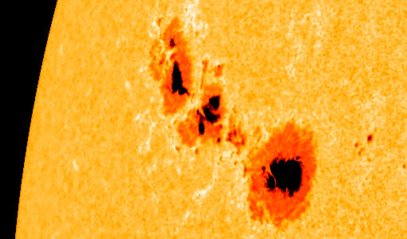

# Sunspot Prediction Model

#### <i>Please go to [sunspot_prediction.ipynb](https://github.com/choyoon88/sunspot_prediction/blob/main/sunspot_prediction-2.ipynb) to see the training and testing. (cmd + mouse left click to open on a separate tab)</i>

Sunspots are temporary phenomena on the Sun's photosphere that appear as spots darker than the surrounding areas. They are regions of reduced surface temperature caused by concentrations of magnetic field flux that inhibit convection. Sunspots usually appear in pairs of opposite magnetic polarity. Their number varies according to the approximately 11-year solar cycle. (Source: [Wikipedia](https://en.wikipedia.org/wiki/Sunspot))

## Content

This data contains Monthly Mean Total Sunspot Number from 1749/01/01 to 2018/07/31

## Conclusion

I have conducted a CNN-LSTM model to predict the monthly mean total number of sunspots with a given dataset that have the number of monthly mean total sunspots recorded from January 1749 to July 2018. I used the learning rate scheduler to tune the learning rate, and trained/validated the dataset with Adam optimiser. The result showed with MSE 478.86 and MAE 14.73.

Predicting the future 100 steps with this model showed fairly acceptable result but there could be a room for improvement.

I conducted another training using a Simple RNN, but the result didn't improve from our first model, so I didn't moved further more with the second model in prediction.

## Acknowledgements

SIDC and Quandl.

Database from SIDC - Solar Influences Data Analysis Center - the solar physics research department of the Royal Observatory of Belgium. [SIDC website](https://www.sidc.be)
